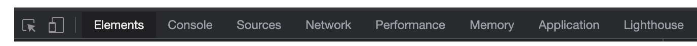

title: DevTools course
style: styles.css
output: index.html

---

# **DevTools**

https://kontur-web-courses.github.io/dev-tools/

---

# Chrome DevTools

https://developer.chrome.com/docs/devtools/

---

# Обзор

---

# CSS

https://developer.chrome.com/docs/devtools/css/

---

# DOM

https://developer.chrome.com/docs/devtools/dom/

---

# Задача

- Зайди на [nytimes.com](https://www.nytimes.com/)
- Перейди по ссылке в любую статью
- Статья будет перекрыта заглушкой
- Пользуясь вкладкой Elements удали баннер и сделай статью читаемой

---

# Задача

- Зайди в чужой профиль в твиттере, например [Павел Егоров](https://twitter.com/xoposhiy) или [Elon Musk](https://twitter.com/elonmusk)
- Добавь или удали статус верифицированного аккаунта
- Измени количество подписчиков
- Перейди в любой твит и отредактируй его
  - добавь твиту лайков
  - измени время публикации
  - добавь в текст ссылку или упоминание
  - измени устройство с которого был послан твит
- Твиттер позволяет выбирать из 3 цветов фона и 6 акцентных цветов, найди нужные css классы и исправь в них цвета на свои

---

